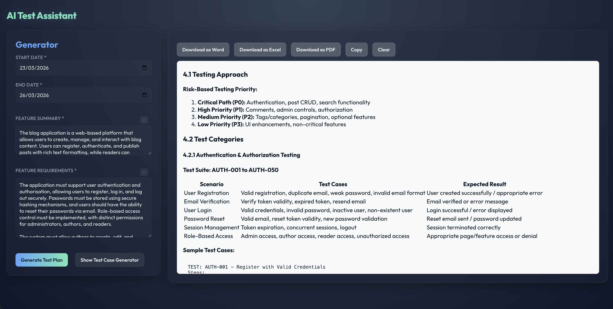
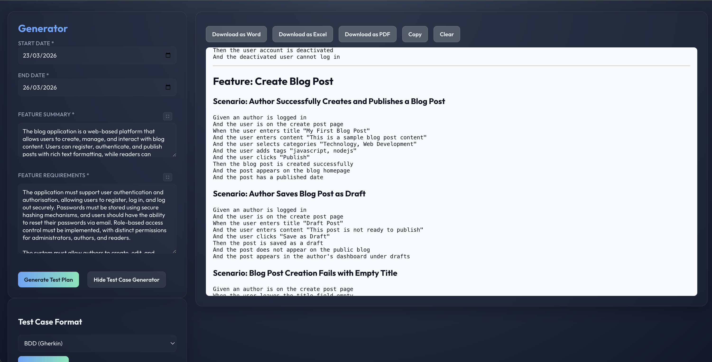

# AI Test Assistant

An AI-powered test planning and test case generation tool using FastAPI and multiple AI models (Google Gemini, OpenAI, Anthropic Claude, and DeepSeek).

## Features

- **Multi-Model Support**: Generate tests using your preferred AI model:
  - Google Gemini (`gemini-2.5-flash`)
  - OpenAI (`gpt-4.1` / `gpt-4o`)
  - Anthropic Claude (`claude-haiku-4-5-20251001` / `claude-opus-4-6`)
  - DeepSeek (`DeepSeek-V3`)
- **Test Plan Generation**: Automatically generate comprehensive test plans with scope, strategies, and timelines.
- **Test Case Generation**: Create test cases in multiple formats:
  - BDD (Gherkin) format
  - JSON format with custom schemas
  - Test Steps format
- **Smart UI**: Interactive web interface with markdown rendering and code highlighting.

## Application Previews

### Test Plan Generator


### Test Case Generator


## Project Structure

```
ai-assistant/
├── app/                          # Main application package
│   ├── main.py                   # FastAPI application entry point
│   ├── clients/                  # AI client implementations (Google, OpenAI, Anthropic, DeepSeek)
│   ├── static/                   # Static files (CSS, JS)
│   ├── templates/                # HTML templates
│   ├── config.py                 # Configuration settings
│   ├── ai_client.py              # AI API client and generation logic
│   └── prompts.py                # Prompt templates for AI
├── assets/                       # Documentation
├── tests/                        # Test suite
│   └── e2e/                      # Playwright end-to-end tests
├── pyproject.toml                # Project configuration
├── .env.example                  # Environment variables template
├── README.md                     # This file
└── uv.lock                       # Dependency lock file
```

## Setup & API Keys Configuration

### Prerequisites

- Python 3.13+
- API keys for your preferred AI models (Google, OpenAI, Anthropic, or DeepSeek)

### Installation

1. Clone the repository:
```bash
git clone <repository-url>
cd ai-assistant
```

2. Create a `.env` file from the template:
```bash
cp .env.example .env
```

3. **Plug and Play API Keys**: Open the `.env` file and add your actual API keys for the models you intend to use. You only need to provide keys for the providers you actually want to use.

```env
# Google Gemini API Key
GOOGLE_API_KEY=

# Anthropic API Key
ANTHROPIC_API_KEY=

# DeepSeek API Key
DEEPSEEK_API_KEY=

# OpenAI API Key
OPENAI_API_KEY=

MODEL_NAME=gemini-2.5-flash
OPENAI_MODEL_NAME=gpt-4.1
ANTHROPIC_MODEL_NAME=claude-haiku-4-5-20251001
DEEPSEEK_MODEL_NAME=DeepSeek-V3

AI_PROVIDER=
AI_MAX_TOKENS=4000

# Application Environment
DEBUG=False

# Server Configuration
HOST=0.0.0.0
PORT=8000
APP_URL=http://localhost:8000
```

4. **Select the Default AI Provider**: In the `.env` file, set the `AI_PROVIDER` to the model you want to use by default (`google`, `openai`, `anthropic`, or `deepseek`).

```env
AI_PROVIDER=anthropic
```

5. Install dependencies using `uv`:
```bash
uv sync
```

### Running the Application

```bash
uv run python -m uvicorn app.main:app --reload
```

The application will be available at `http://localhost:8000`

## Usage

1. Open the web interface at `http://localhost:8000`
2. **Generate Test Plan**: 
   - Enter start and end dates
   - Provide feature summary and requirements
   - Click "Generate Test Plan"
3. **Generate Test Cases**:
   - Click "View Test Case Generator"
   - Select your desired format (Gherkin, JSON, or Steps)
   - For JSON, optionally provide a custom schema
   - Click "Generate Test Cases"

## Dependencies

- **FastAPI**: Modern web framework for building APIs
- **Uvicorn**: ASGI server for running FastAPI
- **Google Genai**, **OpenAI**, **Anthropic**: Official AI SDKs
- **Jinja2**: Template engine for HTML rendering
- **Python-multipart**: For handling form data

See `pyproject.toml` for the complete list of dependencies.

## Configuration

Edit `app/config.py` or `.env` to customize:
- Model selection (e.g., `gemini-2.5-flash`, `gpt-4.1`, `claude-haiku-4-5-20251001`, `DeepSeek-V3`)
- API provider and endpoint configuration
- Application directories
